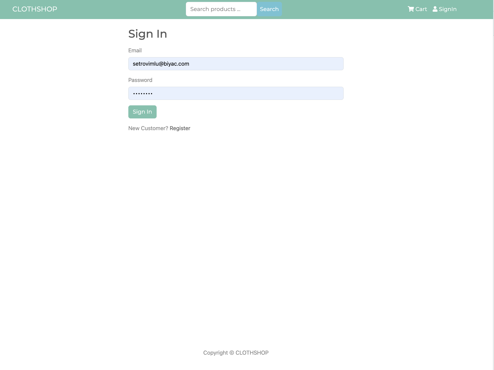
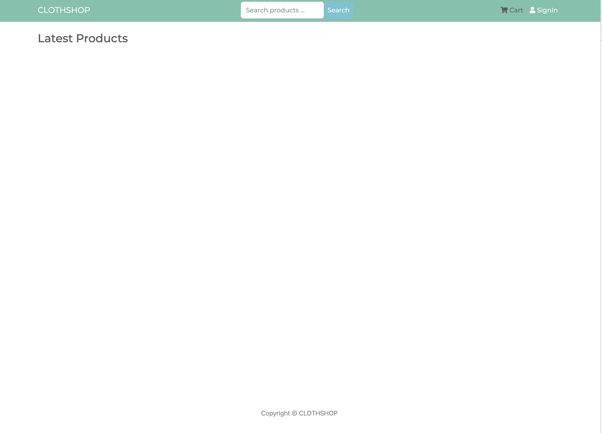

# Mongo-Express-React-Node-Ecommerce-Shopping-Store

# Technology Stack:
Node js
Express Js
MongoDB
JWT
React
Usage
"/.env" update the values/settings to your own

# Screen Shot
 
 

# Install Dependencies
// Install dependencies for server
npm install

// Install dependencies for client
// Go to frontend folder
cd frontend

// Install dependencies
npm install

Run App
// Run server
npm run

// for client
// Go to frontend folder
cd frontend

// Run
npm start

Version: 1.0.0
License: MIT
Author: DIALLO MAMADOU SAMBA
